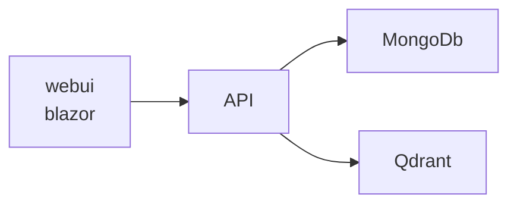

# PragChat - Personal Retrival-Augmented Generation based Chat-GPT 
This is a project for a personal RAG.

The official ChatGPT web interface has some limitations, which is not very handy when I want to find infromation from weeks old chat. Although ChatGPT can export chats when you need, it is not scalable thus I want to build a personal knowledge base that I can controll my chat data easier. It make use of latest .NET Aspire technology to handle the service discovery, orchestration and observability.

## Features
- [ ] Chat with OpenAI API
- [ ] Store chat messages in MongoDb
- [ ] Search message by meta-data (e.g. tags)
- [ ] Search message by similarity
- [ ] Add metadata to individual message
- [ ] Move and reorder message between threads

## Technical Stack
This project based on the following stack:
- C#
- OpenAI API
- .NET Aspire
    - MongoDb as document store
        - Native use-case for messaging app
        - Has C# support
        - Flexible to use local or MongoAltas
        - Scalable
    - Qdrant as vector store
        - Has C# support over ChromaDB
        - Flexible to use local or QdrantCloud
        - Scalable

## Architecture TBD
